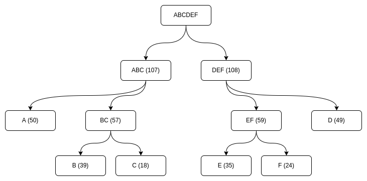
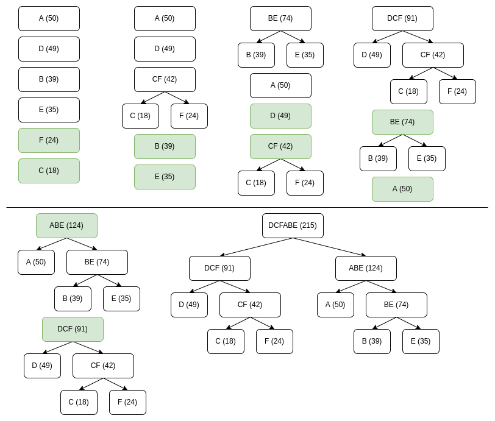

# Лекция №7, 26 октября 2022 года

## Сжатие информации

> Один из способов взлома шифрования - использование частотного анализа.

Сжатие - один из вариантов устранения статистических данных по встречаемости символов; это процесс сокращения количества битов символов, необходимых для хранения одного и того же объема информации. Количество информации при этом не меняется, но меняется модель ее хранения.

Первые попытки к оперативному снижению объема информации появились в операционных системах DOS. В 1991 на уровне ОС были внедрены поточные системы сжатия информации: файлы, сохраняемые на диск, на лету сжимались и при обращении на лету разжимались.

### Алгоритм сжатия информации, основанный на дереве: код Шенона-Фано

Считается статистика использования символов в тексте и для них создается дерево.

Алгоритм:

1. Построить таблицу частот. Например:

|Символ|Встречаемость|
|:--:|:---:|
|А|50|
|B|39|
|C|18|
|D|49|
|E|35|
|F|24|
|...|...|

2. Строится дерево от корня, в котором все кодируемые символы фактически соответствуют корню дерева, если их просуммировать. На каждом следующем уровне в этом дереве делим пополам элементы таблицы частот на примерно равные части (по частоте).
    * Корень = все символы.
    * Каждый уровень - делим пополам таблицу.
    
  
3. Учитывая пути, можем построить коды символов: направо - 0, налево - 1. Например: ```A = 11, B = 101, C = 100, D = 00.```

Получаем коды, длина которых зависит от частоты встречаемости символа. Чем чаще встречается буква, тем короче будет код.

4. Кодирование: заменяем буквы на их код, подряд, будет некратность.
   
5. Раскодирование: например для буквы А. Берем бит из входного потока данных и идем по дереву из корня до листа: 1 - идем в левую часть, опять 1 - опять влево. Дошли до листа - полностью расширофровали букву, возвращаемся в корень и расшифровываем дальше. Код символа однозначно задает путь. 

Главный недостаток алгоритма - когда делим массив на части, мы можем их разделить не самым оптимальным образом. Эту проблему решил Хафман.

### Алгоритм Хафмана (ЛР№6)

Предложил вариант оптимизирования процесса разделения таблицы частот на две половины (2-ой этап в алгоритме Шенона-Фано).

Этот алгоритм отличается от кода Шенона-Фано тем, что дерево строится не сверху от корня при разделении массива символов, а *наоборот*, снизу. В таком случае выполянется учет статистики каждого символа и не может произойти случая, когда неэффективно разбит массив на каком-либо шаге.

Символы сортируются по частоте встречаемости. На каждом шаге используются 2 символа с минимальной частотой для создания узла.

На примере прошлого дерева: сортируем массив по убыванию, получаем ADBEFC, 2 минимальных - F и C. Формируем новый узел C+F, его вес будет 18 + 24 = 42. Дальше заменяем 2 вершины на 1 вершину с весом и опять сортируем массив.

Получится примерно так:



Дальнейшая работа как в коде Шенона-Фано.

Таблица частот не хранится где-то в памяти, она должна храниться в самом сжатом файле (быть его частью), иначе смысл шифрования теряется.

Недостатки алгоритма: требует для шифрования 2 прохода - сначала нужно пройти весь текст, построить для него таблицу частот и только после этого можно шифровать по полученному дереву. Вторая проблема: для расшифровки нужно дерево, т.е. его нужно каким-то образом передать. Варианты: хранить дерево как оно уже построилось либо передавать таблицу частот, так или иначе это накладные расходы.

Для решения этой проблемы был предложен следующий алгоритм.

### Адаптивное сжатие Хафмана

Проблемы:

1. Нужно хранить таблицу частот или структуру дерева;
2. Двупроходность по файлу: для построения частот и для кодирования.

Решение:

1. Предлагается инициализировать дерево сразу всеми символами (обычная ASCII-таблица - равномерное распределение, когда все символы имеют одинаковые частоты). В начале работы этого алгоритма все символы имеют одинаковые частоты.
2. При изменении частоты символа дерево перестраивается. (...?) в таком случае нужно переместить узел в другую ветку этого дерева и пересчитать статитику.

Таким образом получается, что таблицу частот хранить не надо - фактически, она восстанавливается в момент, когда считывается зашифрованный файл.

Один ньюанс: чтобы понимать, что частота символа изменилась, нужно этот признак отмечать в сжатом файле. Каждый раз, когда мы перестраиваем/обновляем дерево, в файле должен быть признак. Для этого, как правило, используются разные escape-символы.

В остальном точно такой же алгоритм Хафмана.

### Алгоритм LZW (Lempel-Ziv-Welch) (ЛР№6 - второй вариант)

В отличие от Хафмана, не требует двупроходности: сразу в сжатом файле содержит всю информацию о тех символах, которые он сжимает.

Алгоритм:

1. Строим словарь 256 символов, и у этих символов есть коды: ```0, 1, 2, ..., 255```. Фактически записываем в этот словарь все символы, которые могут встретиться в нашем файле. 
2. (...?) Считываем фразу из исходного сообщения. 

```256 d o``` - заменили 2 символа на новый код.

```257 o c```

```258 c d```

```259 256 c```

```260 c d```

```M = docdocdoc```

```C = doc256c259```

3. W = M(0): считываем первый символ.
   
4. K = M(i): считываем очередной символ.

5. Считываем первый символ, ищем в словаре комбинацию символов W+K. Очевидно, на первом шаге не найдем, потому что в словаре только одиночные символы.
    * Не нашлось - выводим в сжатый файл W.
    * В любом случае: W + K добавляем в словарь. W = K.

Пункты 4 и 5 повторяем до тех пор, пока не найдем в словаре комбинации.

6. Вывод второго столбца в сжатый файл.

Расчет на то, что в файле будут встречаться повторяющиеся последовательности.

Что является кодом в сжатом файле? Сжатый файл фактически является второй колонкой. Если посмотреть на пример, вторая колонка и будет сжатым файлом.

Распаковка файла: делаем то же самое, только если встречаем символ, код которого больше 255, то это значит, что встретили сжатый символ и его нужно искать в словаре.

Таким образом уходим от особенностей алгоритма Хафмана: уходим от двупроходности и сразу строим сжатый файл.

Чтобы код не разрастался, можно ввести границу, после которой таблица строится заново.

Алгоритмы работают не с байтами, а с кодами. 

### Арифметическое сжатие

Математически красивый алгоритм, который считается практически абсолютно оптимальным алгоритмом энтропийного сжатия.

Самый жесткий вариант шифрования по Хафману, который хорошо тестирует, насколько качественно он реализован, это когда чистоты символов равны числам Фибоначи. Это происходит потому, что когда мы будем формировать суммы символов, будет создаваться идеально разбалансированное дерево (все узлы будут всегда уезжать в одну сторону). На каждом уровне дерево будет иметь 1 лист. Самый редко встречаемый бит будет иметь длину 64 байта. Файл все равно будет сжиматься.

Арифметическое сжатие позволит даже еще эффективнее сжиматься, потому что здесь получается, что разница между самым часто встречаемым и самым редко встречаемым символом не больше чем 256 раз. А бывают ситуации, когда и больше разница, например в 1000, и Хафман здесь не поможет (по Хафману получится сжать не более чем в 256 раз).

Алгоритм: 
1. Строим таблицу вероятностей (частот). Например:

|Символ|Вероятность|
|:--:|:---:|
|А|60%|
|B|20%|
|C|10%|
|D|10%|

2. В соответствии с вероятностями символу назначаются интервалы от 0 до 1:

|Символ|Интервал|
|:--:|:---:|
|А|0 - 0,6|
|B|0,6 - 0,8|
|C|0,8 - 0,9|
|D|0,9 - 1|

Ширина интервала определяется вероятностью символа - чем больше вероятность, тем шире интервал.

3. Для назначенных интервалов производим шифрование. 
   
Изначально есть интервал от 0 до 1, правые и левые границы: ```L = 0``` и ```R = 1```, ширина интервала ```I = R - L```. Далее на каждой итерации пересчитываем:

```L = L + I * L(i)```
```R = L + I * R(i)```

L(i) - левая граница i-ого символа, R(i) аналогично.

Пример: есть текст ```ACD...```. Считываем букву А. На начальном интервале ```L = 0``` и ```R = 1```.

Дальше пересчитываем:

```L = 0 + 1 * 0 = 0```
```R = 0 + 1 * 0,6 = 0,6```

Перешли к новой границе - теперь ```I = 0,6 - 0 = 0,6```, ```L = 0```, ```R = 0,6```.

Для C:

```L = 0 + 0,6 * 0,8 = 0,48```
```R = 0 + 0,6 * 0,9 = 0,54```

Перешли к новой границе - теперь ```I = 0,54 - 0,48 = 0,06```, ```L = 0,48```, ```R = 0,54```.

Для D:

```L = 0,48 + 0,06 * 0,9 = 0,53```
```R = 0,48 + 0,06 * 1 = 0,54```

На каждом шаге  при добавлении символа добавляем глубину дроби. Чем больше символов, тем глубже дробь, и итогом сжатия будет число С в интервале от L до R.

1. Разархивация:

Например, получили число C при сжатии в интервале ([0,53; 0,54]). Это число подаем на вход. Дальше есть интервал: ```I = R - L```, и число, которое находится в интервале, это и есть первый символ, который мы должны расшифровать. ([0,53; 0,54]) => А по таблице. Дальше нужно переписать символ C как ```C = (C - L) / I```. Дальше идем итеративно для каждого символа. (Написано не очень хорошо, желательно посмотреть информацию в других источниках).

Тут должна быть своя арифметика, решающая вопрос переполнения дробных вычислений.